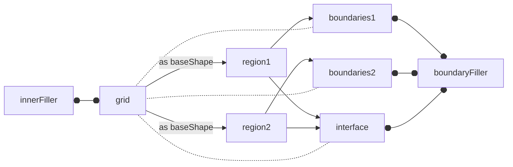

A few design goals govern how `MeshFreeFoam` shapes are implemented, with the most important ones being:

- Support for dynamically loaded models, starting from STL files
- Support for basic geometric operations (adding, subtracting, scaling, rotating, ..., etc.)
- Support for physics on boundary patches as well as easy MPI comms
- Customizable boundary filler, supporting both single-layer and multi-layer filling
- Customizable rho-based inner fillers.

Also, shape classes store no actual grid data to facilitate geometric operations. Dedicated mesh classes will store point coordinates hierarchically.

## Boundary Treatment

Initially, only single-layer boundary layers are implemented. Shapes only read the boundary's interface type, which should be similar to OpenFOAM boundary patches.

At the time of writing, a few boundary types are planned:
- `fixedWall` for stationary walls.
- `elasticWall` for "elastic" surfaces.
- `freeSurface` for free surface interfaces.
- `mixedBoundary` for mixed Neumann-Dirichlet boundary conditions.
- `genericBoundary` for solving arbitrary transport PDEs on the boundary. PDEs are aggregated for later implicit solving with the whole system.

Here is a list of requirements on boundary patches:
1. Awareness of how many sides (1 or 2). The second side can be imaginary if at the processor's boundary.
2. Access to the equation operator classes; however, this may result in circular dependencies.
3. Access to neighboring inner grid points and data.
