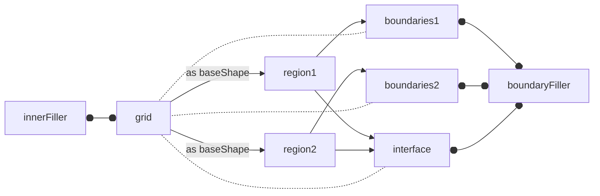

A few design goals govern how `MeshFreeFoam` shapes are implemented, the most important ones being:

- Support for dynamically loaded models, starting from STL files
- Support for basic geometric operations (adding, subtracting, scaling, rotating, ..., etc.)
- Support for physics on boundary patches as well as easy MPI comms
- Customizable boundary filler. Supporting both single-layer and multi-layer filling
- Customizable rho-based inner fillers.

- Also, shape classes store no actual grid data to ease up geometric operations. Dedicated mesh classes will store point coordinates in a hierarchical manner.

## Boundary treatment

At first, only single-layer boundary layers are implemented. Shapes only read in the boundary's interface type. These should be similar to OpenFOAM boundary patches

At the time of writing, few boundary types are planned:
- `fixedWall` for stationary walls.
- `elasticWall` for "elastic" surfaces.
- `freeSurface` for free surface interfaces.
- `mixedBoundary` for mixed Neumann-Dirichlet boundary conditions.
- `genericBoundary` for arbitrary transport PDE solving on the boundary. PDE's are aggregated to be solved later implicitly with the whole system.

From this, here is a list of requirements on boundary patches:
1. Awareness of how many sides (1 or 2). Second side can be imaginary if at the processor's boundary.
2. Access to the equation operator classes, hence this may result in circular dependency.
3. Access to neighboring inner grid points and data.
